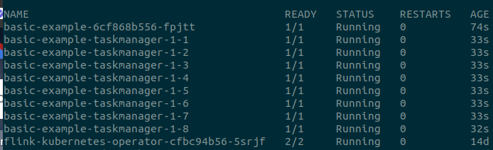

## Setup a Flink deployment with Kubernetes

### Requirements
- A Kubernetes cluster (see [Installation guide](https://kubernetes.io/docs/setup/production-environment/tools/kubeadm/install-kubeadm/))
- Configure storage classes in Kubernetes (We use NFS in this example)
    - Create the NFS server (see [nfs/README.md](../nfs/README.md))
    - Create a Storage Class (see [storage_class/README.md](../storage_class/README.md))
- Deploy Minio with storage (see [minio/README.md](../minio/README.md))
- Have Helm installed

### Deploy the Flink Kubernetes Operator
```bash
helm repo add flink-operator-repo https://downloads.apache.org/flink/flink-kubernetes-operator-1.11.0
helm install flink-kubernetes-operator flink-operator-repo/flink-kubernetes-operator
```
A flink-kubernetes-operator deployment will be created, and should appear in the list of pods:
```bash
kubectl get pods
```

### Configure InfluxDB Monitoring (Optional)
```bash
docker run -d --name=myinfluxdb -p 8086:8086 -v $PWD/influxdb:/var/lib/influxdb influxdb:1.8
```

Create a database for Flink:
```bash
docker exec -it myinfluxdb influx -execute 'CREATE DATABASE flink'
```

Keep the IP/Port, and database name to expose them in Flink configuration later.


Create a Persistent Volume Claim (PVC) for Flink Metrics:

```yaml
apiVersion: v1
kind: PersistentVolumeClaim
metadata:
  name: flink-metrics-pvc
spec:
  accessModes:
    - ReadWriteMany
  resources:
    requests:
      storage: 1Gi
  storageClassName: nfs-csi
```

```bash
kubectl apply -f flink-metrics-pvc.yaml
```

### Build the Docker image of the Flink
```bash
docker build -t <username>/flink:2.0  -f Dockerfile .
```

### Deploy a Flink Job

- Configure the yaml file in `basic.yaml`. For example:
  - `image`: Set to your Docker image `<username>/flink:2.0`
  - `influxdbHost`: Set to the IP of your InfluxDB instance
  - `influxdbPort`: Set to the exposed port
  - `influxdbDatabase`: Set to `flink`
  - `pvcName`: Set to `flink-metrics-pvc`
  - TaskManager resources, e.g., `cpu` and `memory`
  - TaskParallelism
  - Number of Task Slots (`taskmanager.numberOfTaskSlots`)

```bash
kubectl create -f basic.yaml
```

After deployment, there will be one new pod for the Job Manager, and one or more pods for the Task Managers, depending on your configuration.

```bash
kubectl get pods
``` 



### Experiments

- We include a folder `slot_count_impact` with scripts to run the experiments for different configs, get the metrics and plot the results.
